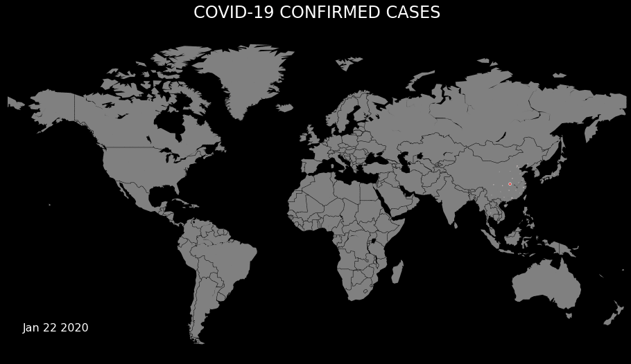

<h1 align="center">COVID-19</h1>

## Description
Due to the worldwide COVID-19 pandemic, I have been spending a lot of time at home recently, avoiding contact with people. I decided to spend this time constructively and start analyzing data about the virus.

## Hit the ground running

``` bash
# clone repository
git clone https://github.com/SkalskiP/COVID-19.git

# navigate to main directory
cd COVID-19

# set up and activate conda environment
conda env create -f environment.yml
conda activate covid_19
```

## Visualizations

<p align="center"> 
    
</p>

<p align="center"> 
    <b>Figure 1.</b> Confirmed COVID-19 cases worldwide
</p>
